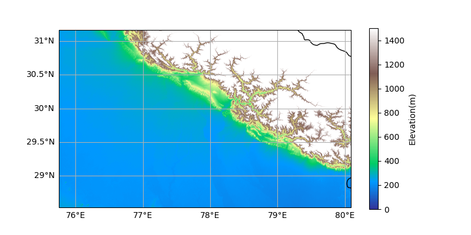
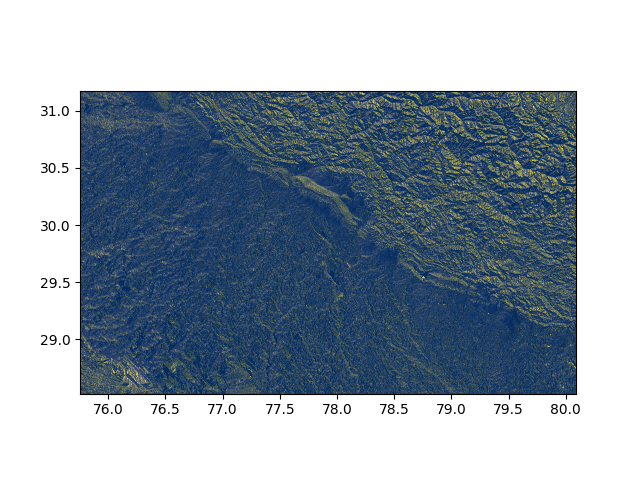
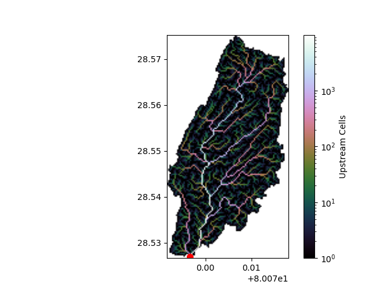

# Hydrological Catchment Analysis using DEM
Terrain-based hydrological analysis using DEM to extract flow patterns and catchment areas

This project demonstrates how terrain elevation data (DEM) can be used to model water flow, identify drainage networks, and extract catchment areas using Python.

It simulates how water naturally flows across land — a critical step in hydropower planning, flood analysis, and energy system modeling.

---

## 🌍 Study Area

Region selected (India):
- Longitude: 75.05°E → 81.62°E  
- Latitude: 27.67°N → 32.27°N  

This region includes parts of North India with varying terrain suitable for hydrological analysis.

---

## 📊 Workflow

### 1. Digital Elevation Model (DEM)
- Input: Raster terrain data
- Represents elevation at each grid cell

### 2. Terrain Conditioning
- Fill pits (remove single-cell traps)
- Fill depressions (remove basins)
- Resolve flat areas

👉 Ensures realistic water flow

---

### 3. Flow Direction (D8 Algorithm)
Each cell is assigned a direction of steepest descent.

This creates a **drainage network** across terrain.

---

### 4. Flow Accumulation
- Counts how many upstream cells flow into each point
- High values = rivers / streams
- Low values = ridges

---

### 5. Catchment Delineation
- A pour point is selected
- System traces all upstream contributing area

👉 This defines the **watershed**

---

## 📸 Results

### Terrain (DEM)


---

### Flow Direction


---

### Catchment Area

## ⚡ Why This Matters

This analysis is the foundation of:

- Hydropower site selection  
- River basin planning  
- Flood prediction  
- Water resource management  
- Energy system optimization  

👉 It directly connects to real-world infrastructure decisions.

---

## 🧠 Tech Stack

- Python  
- Pysheds  
- NumPy  
- Matplotlib  
- Cartopy  

---

## 📦 Data Source

DEM data obtained from OpenTopography:

https://portal.opentopography.org/raster?opentopoID=OTALOS.112016.4326.2&minX=75.05200235126539&minY=27.678663213450164&maxX=81.62622069893403&maxY=32.275057894214754

Note:
- Data not included due to size constraints
- Download and place as `dem.tif` before running

---

## ▶️ How to Run

```bash
pip install -r requirements.txt
python main.py
